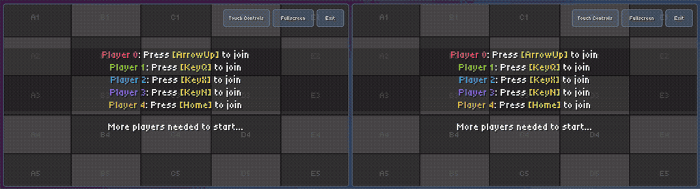
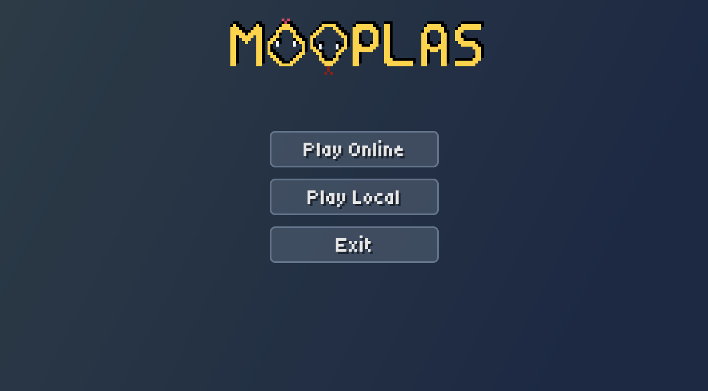
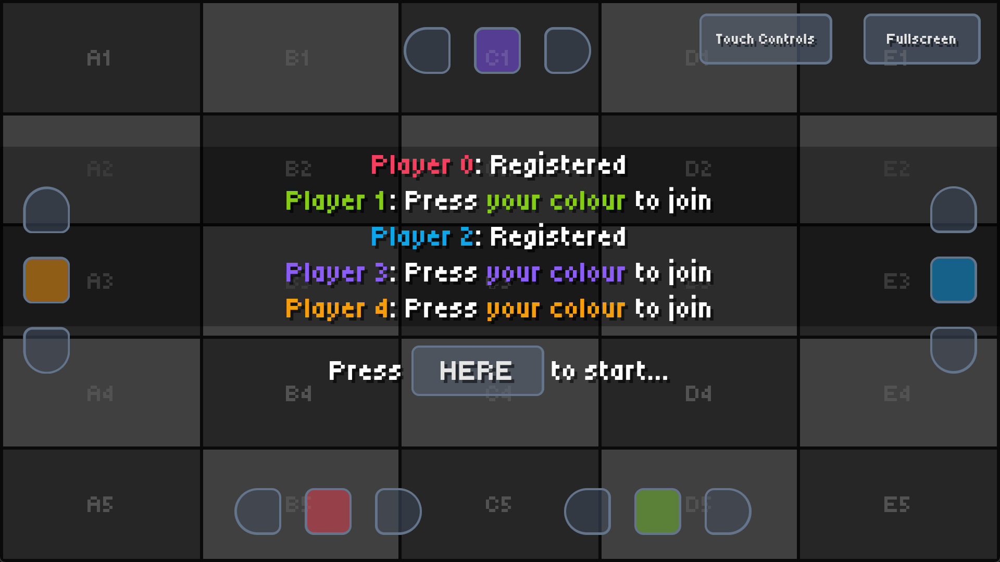

<p align="center">
  
</p>

This repository contains a basic multiplayer game inspired by _Achtung, die Kurve!_, written in Rust using Bevy Engine
(v0.17). The goal of the project was to explore network programming when real-time movement is involved.

## Features

- Implementation of _Achtung, die Kurve!_ with screen wrap-around
- Local multiplayer (up to 5 players)
- Online multiplayer (up to 5 players) over UDP using `bevy_renet`
- Touch controls for mobile devices

## Demo

Online multiplayer:



Menu:



Lobby with touch controls enabled:



In-game:


## How to develop

### Using Nix Flakes, JetBrains RustRover & Direnv

You can run this project in any way you like, but I have set things up to make it easy to develop using JetBrains
RustRover. For this, you'll need:

- `direnv`
- Any Direnv integration plugin e.g. https://plugins.jetbrains.com/plugin/15285-direnv-integration
- `nix`

This way, you'll just need to `direnv allow` in the project directory after which all prerequisites (incl. Rust, Cargo,
all Bevy dependencies, etc.) will be available to you. The JetBrains plugin will ensure that the environment is
available to your IDE and you can run the project from there (vs `cargo build` and `cargo run` in the terminal).

##### How to deal with RustRover making problems again

RustRover will always fail to sync the project when you open it because it doesn't wait for `direnv`. Just re-sync
immediately after the failure and it will work.

Did RustRover forget where the Rust standard library is again? Run the below and update the path in the settings:

```
find /nix/store -type d -name rust_lib_src
```

##### Using the Nix flake

Upgrade the flake by running `nix flake update --flake .` in the repository's base directory.

## How to build WASM for the web

#### Prerequisites

1. Run (already included in the Flake if using Nix):
   ```shell
   rustup target add wasm32-unknown-unknown
   ```
2. Set `RUSTFLAGS` environment variable:
    1. **Linux**:
       ```bash
       export RUSTFLAGS="--cfg=web_sys_unstable_apis --cfg=getrandom_backend=\"wasm_js\""
       ```
    2. **Windows**:
       ```powershell
       $env:RUSTFLAGS="--cfg=web_sys_unstable_apis --cfg=getrandom_backend=`"wasm_js`""
       ```
3. Make sure you have Node.js with `serve` installed

#### Building

Then you can build the WASM file:

1. Build the WASM file:
   ```shell
   RUSTFLAGS='--cfg=web_sys_unstable_apis --cfg=getrandom_backend="wasm_js"' cargo build --target wasm32-unknown-unknown --release
   ```
2. Clean the `/www/public` directory and copy the game's assets over:
    - **Linux**:
      ```shell
      ./scripts/clean-mooplas-files.sh
      ./scripts/copy-assets.sh
      ```
    - **Windows**:
       ```powershell
       ./scripts/clean-wasm-files.ps1
       ./scripts/copy-assets.ps1
       ```
3. Run `wasm-bindgen` to generate the JS bindings and move all relevant files to the `/www/public` directory:
    1. **Linux**:
       ```shell
       wasm-bindgen --out-dir ./www/public --target web ./target/wasm32-unknown-unknown/release/mooplas.wasm
       ```
    2. **Windows**:
       ```powershell
       wasm-bindgen.exe --out-dir ./www/public --target web ./target/wasm32-unknown-unknown/release/mooplas.wasm
       ```

#### Optimising

You can optimise the WASM file (from the
[Unofficial Bevy Cheat Book](https://bevy-cheatbook.github.io/platforms/wasm/size-opt.html)):

   ```shell
   # Optimize for size (z profile).
   wasm-opt -Oz -o output.wasm input.wasm
   
   # Optimize for size (s profile).
   wasm-opt -Os -o output.wasm input.wasm
   
   # Optimize for speed.
   wasm-opt -O3 -o output.wasm input.wasm
   
   # Optimize for both size and speed.
   wasm-opt -O -ol 100 -s 100 -o output.wasm input.wasm
   ```

#### Running

Finally, to run the game in your browser locally, run the below and paste the URL copied to your clipboard into your
browser:

```shell
npx serve ./www/public
```