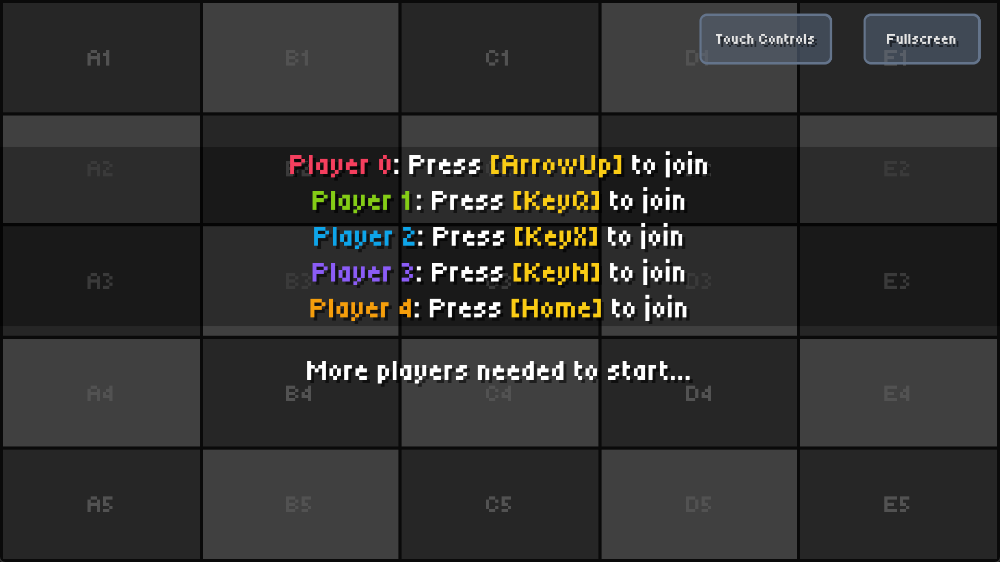
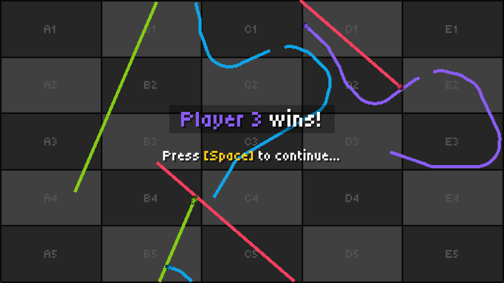

# Mooplas

This repository contains a basic multiplayer game inspired by _Achtung, die Kurve!_, written in Rust using Bevy Engine (
v0.17). The goal of the project is to do some basic network programming and improve my Rust skills.

> [!NOTE]
> This project is still in active development. So far, I've only added local multiplayer support. Online multiplayer
> support is next.

## Demo





## How to develop

### Using Nix Flakes, JetBrains RustRover & Direnv

You can run this project in any way you like, but I have set things up to make it easy to develop using JetBrains
RustRover. For this, you'll need:

- `direnv`
- Any Direnv integration plugin e.g. https://plugins.jetbrains.com/plugin/15285-direnv-integration
- `nix`

This way, you'll just need to `direnv allow` in the project directory after which all prerequisites (incl. Rust, Cargo,
all Bevy dependencies, etc.) will be available to you. The JetBrains plugin will ensure that the environment is
available to your IDE and you can run the project from there (vs `cargo build` and `cargo run` in the terminal).

##### How to deal with RustRover making problems again

RustRover will always fail to sync the project when you open it because it doesn't wait for `direnv`. Just re-sync
immediately after the failure and it will work.

Did RustRover forget where the Rust standard library is again? Run the below and update the path in the settings:

```
find /nix/store -type d -name rust_lib_src
```

##### Using the Nix flake

Upgrade the flake by running `nix flake update .` in the repository's base directory.

